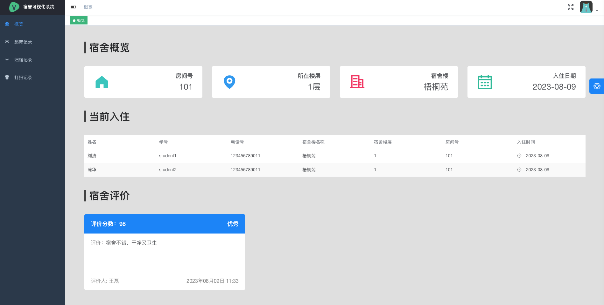
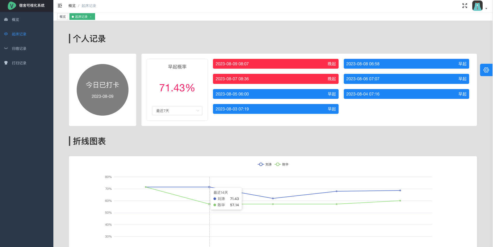
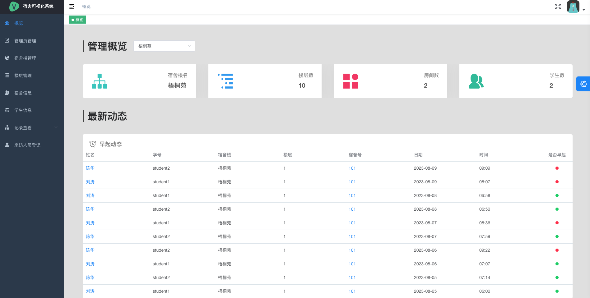
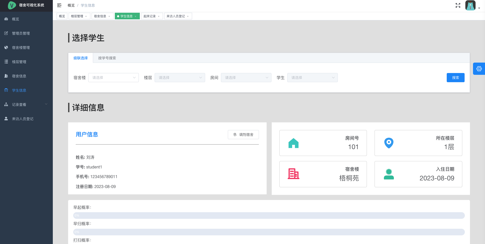
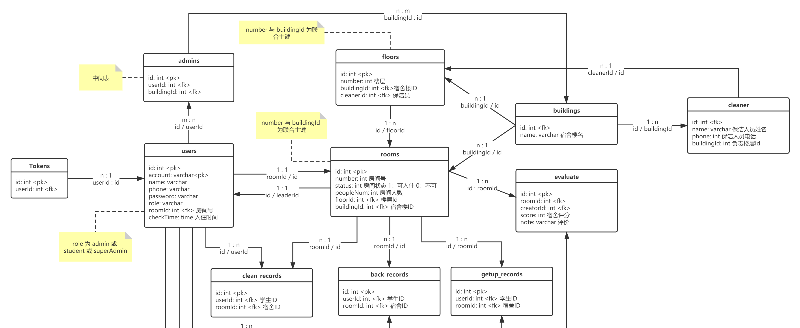
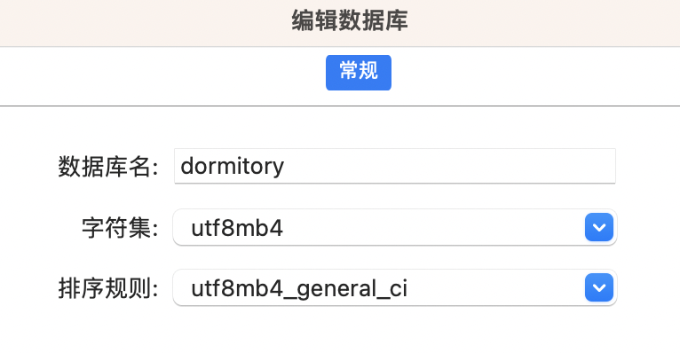
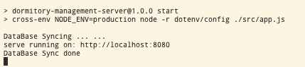

> 当前项目处于佛系维护状态，有 bug 可以反馈在 issues 中。如果这个项目拯救了你的毕设或者大作业的话，赏个星星吧。

# 0. 概览

基于 Koa 以及 VueJS 的宿舍管理系统。









## 更新记录：

### 2023.05.09

新增功能：

- 【楼层管理】添加『入住人员信息』模块，显示入住学生、性别、院系、专业的人数，可用饼图表示
- 【用户信息】学生用户添加性别、院系、专业字段
- 【楼层管理】每层楼显示空余床位和已入住人数
- 【宿舍信息】宿舍信息显示空余床位，新增修改床位数的功能
- 【学生信息】如果是超级管理员，会有『更换寝室』按钮，可以修改学生宿舍
- 【管理员系统】新增『来访人员登记』模块，可以添加来访人员记录，仅提供新增功能，记录信息包含姓名、电话号、身份证、性别等，登记日期自动生成

代码：

- 支持使用环境变量修改服务端配置，将 `server/.env.template` 重命名为 `.env` 文件即可应用配置
- 升级 Vue 版本为 2.7
- 升级 echarts，移除 v-charts，使用 vue-echarts 作为 Vue 图表组件
- 新增 `npm run db:init` 指令，快捷初始化数据库

# 1. 需求分析

主要需求：

- 学生信息录入、修改、删除、查询
- 宿舍管理评分
- 学生早起率、懒床率
- 学生宿舍打扫频率
- 学生晚归情况
- 楼层管理

考虑到实用性，该系统需要拆分为两大子系统，一个是学生端系统，一个是后台管理端系统。学生端系统主要提供给学生使用，负责一些宿舍记录及个人信息记录的基本操作；后台管理模块则是主要负责对所有学生信息的整理，提供宿舍管理、楼层管理、数据查看等权限，提供给宿舍管理员使用的。

## 1.1 学生系统

学生系统拥有以下功能：

- 创建账户
- 分配宿舍
- 填写个人信息
- 修改个人信息
- 起床打卡（用于统计懒床率）
- 归宿登记（用于统计晚归情况）
- 打扫记录（用于统计宿舍打扫频率）
- 查看宿日常数据

## 1.2 管理系统

管理系统拥有以下功能：

- 楼层管理
- 宿舍评价
- 宿舍信息管理
- 学生信息查看
- 保洁人员管理
- 统计学生早起率
- 统计学生宿舍打扫频率
- 统计学生晚归

超级管理员在享有上述管理员同等权限的同时额外拥有如下功能：

- 创建管理员
- 创建宿舍楼
- 为宿舍楼分配管理员
- 为宿舍楼分配保洁人员

# 3. 技术分析

前端：

- Vue 作为基础框架
- vue-router 控制路由（hash 模式）
- vuex 状态管理
- axios 接入数据
- [Vue-element-admin](https://github.com/PanJiaChen/vue-element-admin) 作为基础框架

后台（Nodejs）：

- Koa 作为基础框架
- koa-router —— 服务端路由控制
- koa-static —— 读取静态文件
- koa-jwt —— JWT 登录校验
- koa-body —— http body 数据处理
- koa-compress —— Gzip 压缩
- koa-cors —— CORS 解决跨域问题
- sequelize —— ORM

数据库：

- MySQL

数据库设计一览：



# 4. 目录介绍

clinet 目录下为前端的项目文件， server 为后台目录下的文件

## 4.1 Clinet 目录

### 4.1.1 根目录

**public :**

HTML 模板和静态资源，参考 [vue-cli 官方文档](https://cli.vuejs.org/zh/guide/html-and-static-assets.html)

**src :**

源码目录

**.eslint\* :**

Eslint 代码规范规则相关

**.prettierrc.js :**

Prettier 代码格式化相关

**vue.config.js :**

webpack 规则，无需修改

### 4.1.2 src 源码目录（重点）

**api：**

抽离出的单独的请求文件，请求后台的 url

**assets：**

前端的静态文件资源

**components：**

前端的页面的组件，重点组件有：

- GroupSelector：级联选择器组件
- RecordTable：记录表格组件
- RoomSelector：房间级联选择器组件

**filter：**

Vue 过滤器，详见 [Vue 官方文档](https://cn.vuejs.org/v2/guide/filters.html)

**icons：**

icon 图标文件

**layout：**

最外层的整体布局组件

**router：**

前端路由系统，详见 Vue-Router 文档

**store：**

前端状态管理系统，详见 Vuex 文档

**utils：**

页面中的某会被复用的方法，如计算日期、格式化日期的方法，会被抽离到 utils 中，再在各个页面中被引入

**views（重点）：**

每个页面的代码都在这里

**App.vue：**

最外层容器页面

**main.js：**

入口文件

**settings.js：**

配置文件（无需更改）

## 4.2 server 目录

server 目录下的 static 文件为静态文件目录，前端 Vue 源码编译好之后会自动存放到 static 目录下。src 为源码目录，以下介绍为 src 目录下的文件：

**app.js：**

入口文件，所有的框架在此引入

**config.js：**

配置文件，除了数据库相关的文件，其余配置项不要更改

**utils：**

后台某些会被复用的方法，会被抽离到 utils 中，再在各个页面中被引入

**struct：**

全局中新建的结构体（非重要，涉及 Javascript 面向对象设计）

**routes：**

后台路由

**model：**

后台 Model 层（定义数据库表结构）

**db：**

数据库连接与生成的方法

**controller：**

后台的 Controller 层

**middle：**

Koa 中间件，详见 Koa 中间件机制。

# 5. 项目启用方式

预先准备 Node 环境，**避免各种奇怪的问题，建议使用 16.x 版本**，建议[使用 volta 管理 node 版本](https://blog.esunr.xyz/2023/07/d99593770741.html#1-Volta)。

## 5.1 运行后台

数据库中创建表 "dormitory"（如下为 Navicat 数据库管理工具）：



> 如果 mysql 低版本选择 utf8，高版本选择 utf8mb4

复制 `server/.env.template` 重命名为 `.env`，修改相关配置。

使用命令行工具移动至 server 目录下，运行：

```js
## 安装依赖
$ npm install

## 初始化数据库（该指令执行后会强行覆盖数据库中已有的数据，仅运行一次即可！）
$ npm run db:init

## 运行项目
$ npm run start
```

看到以下输出，即为成功：



浏览器访问 `http://localhost:8080`

预置账号：

- 管理员（admin 123456）
- 超级管理员（superAdmin 123456）
- 学生用户1（student1 123456）
- 学生用户2（student2 123456）

> 初始化的数据可以在 `db_generator.js` 中的 `createDefaultData` 方法中修改

## 5.2 前端文件

按照上述步骤已经可以正常运行项目，如果需要修改与调试前端页面请按照以下步骤：

> 首先要确保已经在 `/clinet` 目录下运行过 `npm install` 安装好了前端依赖

1. 在 `/server` 目录下运行 `npm run dev` 开启后台开发模式
2. 在 `/client` 目录下运行 `npm run dev` 开启前端开发模式
3. 修改 `/clinet` 目录下的任意文件
4. 修改完成后，在 `/client` 目录下运行 `npm run build:prod`

> 构建时会出现警告，如 `$weight: Passing a number without unit % (0) is deprecated.` 无视即可，不影响功能

# 6. API 文档

共计 32 个接口，接口文档：https://documenter.getpostman.com/view/6817046/SzKWuHJh

